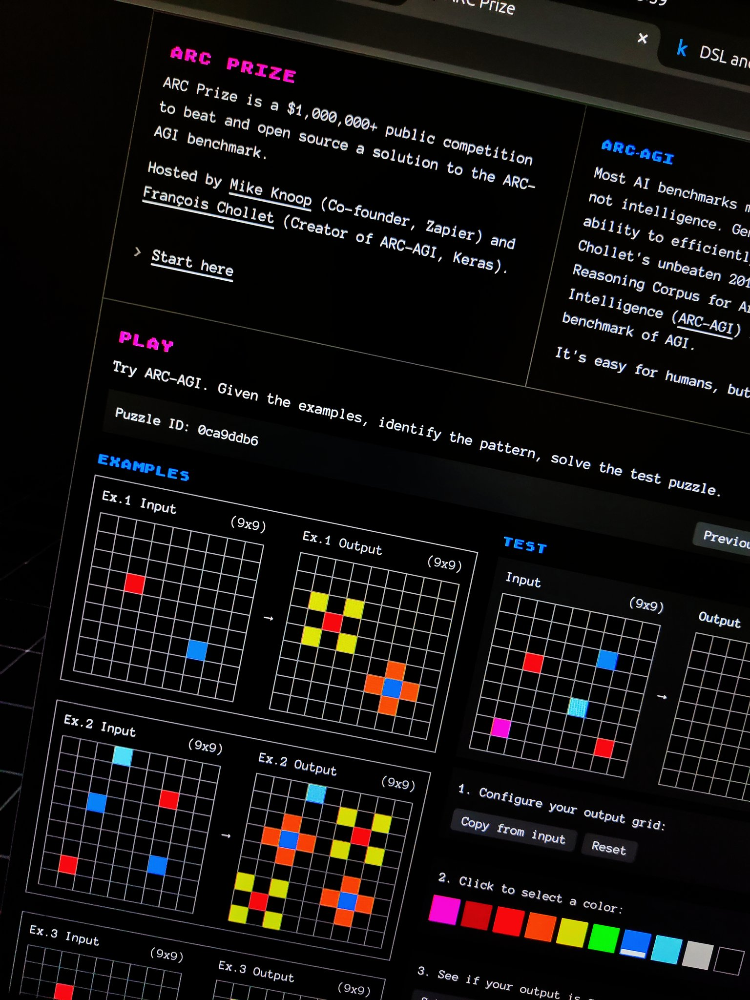

# arc-agi-attempts (wip)

In this repository I have code and brief explanations of my attempts at the ARC-AGI (2024) challenges.



## shout outs before i get started
- This repository contains a [patterns](patterns) folder with a dataset where each training example example is prepared for training (training todo, but use cases explained below). This dataset was generated using [Glaive.ai](glaive.ai)'s synthetic data platform.
- I spent so much time tuning the prompts, trying different methods and a bunch of stuff that didn't make to into this repository. I'm going to shout out [Glaive.ai](glaive.ai) again here for sponsoring credits, I work at glaive so please bare with my biased shout outs!!! But if you or your company are in need for high quality synthetic datasets hmu or sign up and send us feedback :)
- (unbiased shoutout) Finally, I made heavy use of [Michael](https://x.com/bayesilicon)'s dsl.py file and his Github repository [michaelhodel/arc-dsl](https://github.com/michaelhodel/arc-dsl/blob/main/dsl.py). I would recommend checking it out.

## attempts

### 1. direct grid solution
- Located in: [`direct-arc-solution.ipynb`](direct-arc-solution.ipynb)
- Description: A pattern-matching approach where Claude analyzes the grids and makes direct predictions
- Key features:
  - Takes input/output grids displayed with emojis
  - Analyzes patterns through a thought process
  - Makes predictions without writing explicit code
  - Uses XML tags like `<thought>`, `<prediction>`, `<criticism>` to structure reasoning
  - Provides final predictions in emoji grid format

### 2. direct code solution
- Located in: [`direct-code-arc-solution.ipynb`](direct-code-arc-solution.ipynb)
- Description: A straightforward approach where Claude directly attempts to write code to solve the puzzle after analyzing the patterns
- Uses single-shot code generation with a customized prompt template
- Validates solutions against test cases

### 3. iterative code solution
- Located in: [`iterative-code-arc-solution.ipynb`](iterative-code-arc-solution.ipynb)
- Description: An iterative approach where Claude gradually develops a solution through multiple steps
- Features:
  - Breaks down problem analysis into smaller steps
  - Maintains conversation history to build upon previous insights
  - Allows for refinement and correction of hypotheses

### 4. information bank based solution
- Located in: [`bank-code-arc-solution.ipynb`](bank-code-arc-solution.ipynb)
- Description: A structured approach that maintains a "bank" of collected knowledge and explorations
- Key components:
  - COLLECT phase: Gathers basic information about patterns
  - EXPLORE phase: Tests specific hypotheses about transformations
  - Uses systematic validation before proposing final solutions
- Benefit of this approach is, context lengths are shorter because we only use the information bank

## synthetic training data
The patterns folder contains some synthetic training patterns. These are explicit descriptions of transformation types seen in ARC puzzles (e.g., grid scaling, region filling, object manipulation).

The plan is to potentially use these patterns to:
- Train models to recognize common transformation types
- Generate additional training examples of similar transformations
- Expand the training data in a controlled way

This is still a work in progress.

## file structure

```
.
├── README.md
├── requirements.txt
├── puzzles/
│   └── arc-agi_test_challenges.json
├── prompts/
│   ├── direct_prompt.txt
│   ├── iterative_2_prompt.txt
│   └── bank_prompt.txt
└── attempts/
  └── [generated attempt logs]
```

## setup

1. Set up environment:
```bash
# Clone repository
git clone https://github.com/yourusername/arc-agi-attempts.git
cd arc-agi-attempts

# Create and activate virtual environment
python3 -m venv venv
source venv/bin/activate

# Install dependencies
pip install -r requirements.txt
```

2. Configure API key:
```bash
# Create .env file
echo "OPENROUTER_API_KEY=your_key_here" > .env
```